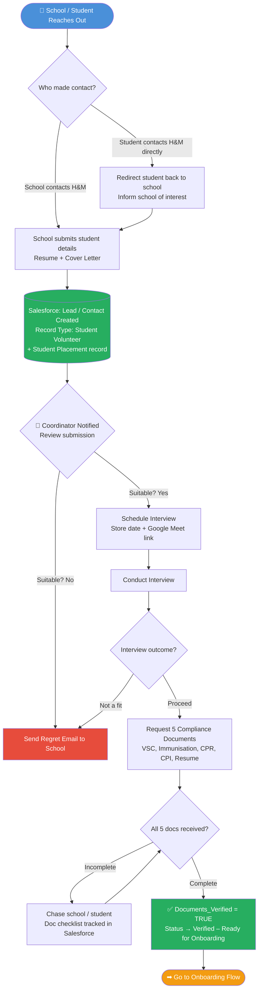
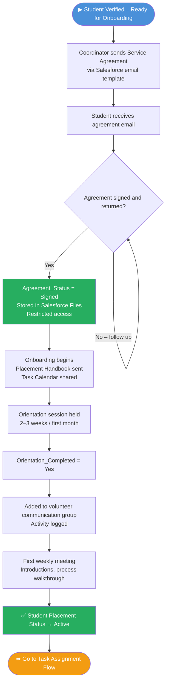
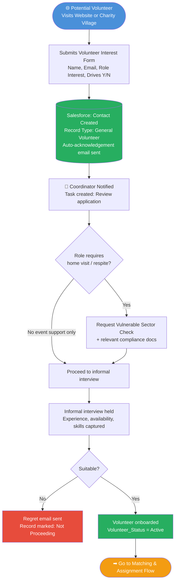
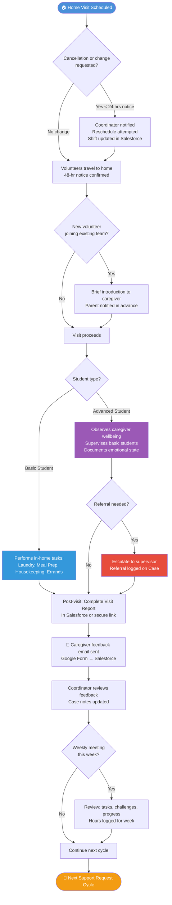
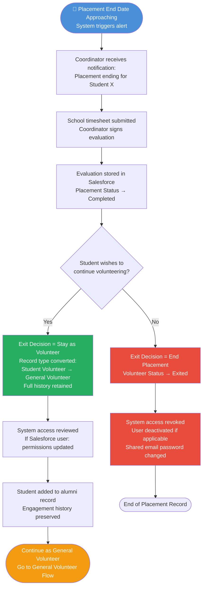
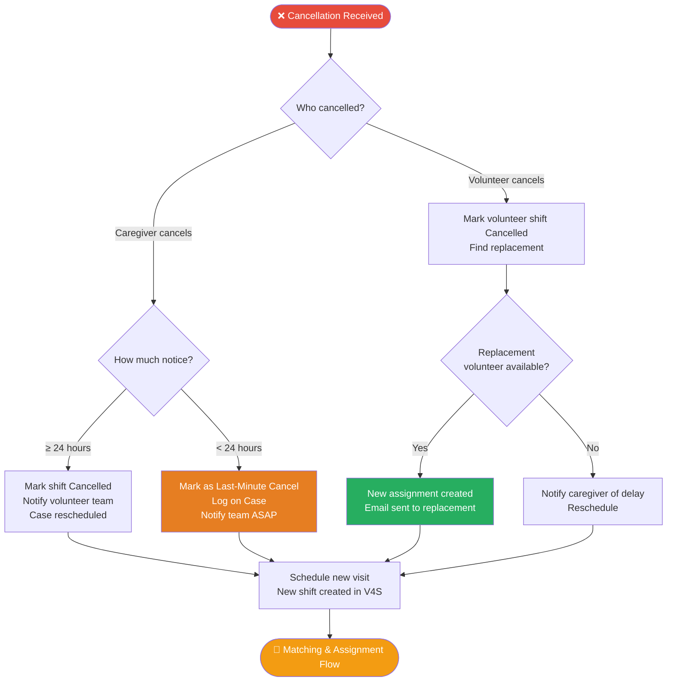
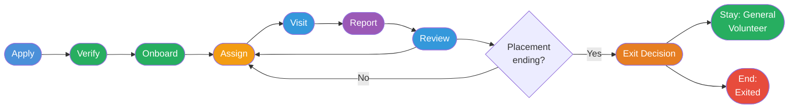

# Hearts and Mind — Volunteer User Flow Diagrams
## Mermaid JS Format — Extractable for Presentation

---

## Flow 1: Student Volunteer Intake (School → Salesforce)

---

## Flow 2: Student Volunteer Onboarding

---

## Flow 3: General Volunteer Intake (Walk-In)

---

## Flow 4: Volunteer Matching & Assignment to Support Request

```mermaid
flowchart TD
    A([📋 Case: Support Request Active\nPhase 1 — caregiver case live]) --> B[Coordinator opens Case\nClicks Assign Volunteers]
    B --> C[System filters available volunteers\nby: Status=Active, Availability, Proximity]
    C --> D{Caregiver beyond\ntransit distance?}
    D -- Yes --> E[Filter: Drives = Yes required\nfor at least 1 volunteer]
    D -- No --> F[All available volunteers shown]
    E --> F
    F --> G{Female caregiver\nor children present?}
    G -- Yes --> H[Gender Rule Applied:\nNo 2-male pairings allowed]
    G -- No --> I[Standard pairing options]
    H --> I
    I --> J[System shows top\nrecommended pairings]
    J --> K[Coordinator selects\n1–3 volunteers]
    K --> L{Skills match\ncaregiver needs?}
    L -- Gap detected --> M[System flags warning\nCoordinator can override + note]
    L -- Match OK --> N[Create V4S Volunteer Job\n+ Volunteer Shift linked to Case]
    M --> N
    N --> O[📧 48-hour notice emails sent\nto assigned volunteers]
    O --> P{First visit to\nthis household?}
    P -- Yes --> Q[Schedule Meet & Greet\nIntroduce team to caregiver]
    P -- No --> R[Confirm visit details]
    Q --> R
    R --> S([➡ Go to Home Visit & Feedback Flow])

    style A fill:#4A90D9,color:#fff
    style H fill:#E67E22,color:#fff
    style M fill:#E67E22,color:#fff
    style N fill:#27AE60,color:#fff
    style S fill:#F39C12,color:#fff
```

---

## Flow 5: Home Visit Execution & Feedback

---

## Flow 6: Student Exit & Transition

---

## Flow 7: Cancellation & Reassignment

---

## Flow 8: Full End-to-End Volunteer Lifecycle (Summary View)

---

*These diagrams can be rendered at https://mermaid.live or embedded in any Mermaid-compatible tool.*
