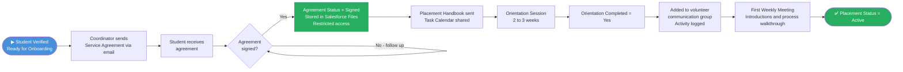
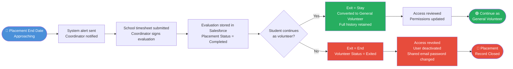
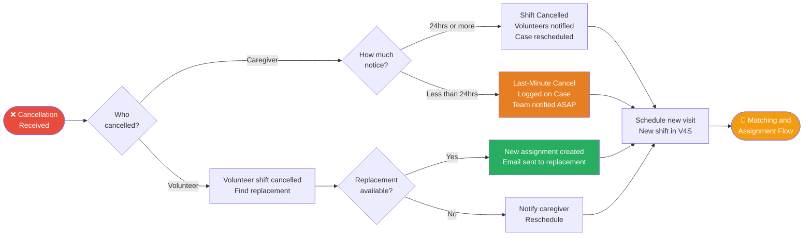
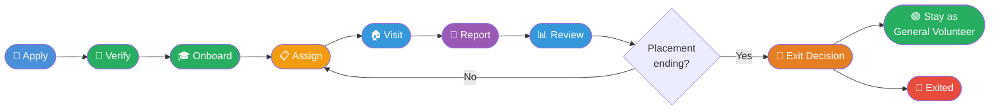

# Hearts and Mind — Volunteer User Flow Diagrams
## Mermaid JS Format — Left to Right (LR) — Presentation Ready

> All flows use `flowchart LR` for clean left-to-right presentation layout.
> Render at https://mermaid.live or import SVG into Figma.

---

## Flow 1: Student Volunteer Intake (School → Salesforce)

```mermaid
flowchart LR
    A([🏫 School or Student\nReaches Out]) --> B{Who made\ncontact?}

    B -- Student contacts\nH&M directly --> C[Redirect student\nback to school]
    B -- School contacts\nH&M --> D[School submits student\nResume + Cover Letter]
    C --> D

    D --> E[(Salesforce\nLead → Contact Created\nRecord Type: Student Volunteer\n+ Student Placement record)]

    E --> F{Coordinator\nreviews}
    F -- Not suitable --> G([❌ Regret Email\nSent to School])
    F -- Suitable --> H[Schedule Interview\nDate + Google Meet stored]

    H --> I[Conduct Interview]
    I --> J{Interview\noutcome?}
    J -- Not a fit --> G
    J -- Proceed --> K[Request 5 Compliance Docs\nVSC · Immunisation · CPR · CPI · Resume]

    K --> L{All 5 docs\nreceived?}
    L -- Incomplete --> M[Chase school\nDoc checklist tracked]
    M --> L
    L -- Complete --> N([✅ Documents Verified\nStatus → Ready for Onboarding])

    style A fill:#4A90D9,color:#fff
    style E fill:#27AE60,color:#fff
    style G fill:#E74C3C,color:#fff
    style N fill:#27AE60,color:#fff
```

---

## Flow 2: Student Volunteer Onboarding

---

## Flow 3: General Volunteer Intake (Walk-In)

```mermaid
flowchart LR
    A([🌐 Potential Volunteer\nWebsite or Charity Village]) --> B[Submits Volunteer\nInterest Form]
    B --> C[(Salesforce\nContact Created\nGeneral Volunteer\nAuto-acknowledgement sent)]
    C --> D[Coordinator Notified\nTask: Review application]
    D --> E{Role requires\nhome visit?}
    E -- Yes --> F[Request VSC and\nCompliance Docs]
    E -- Event support only --> G[Proceed to\nInformal Interview]
    F --> G
    G --> H[Interview held\nSkills and availability captured]
    H --> I{Suitable?}
    I -- No --> J([❌ Regret Email Sent\nRecord: Not Proceeding])
    I -- Yes --> K([✅ Volunteer Status = Active])
    K --> L([➡ Matching and\nAssignment Flow])

    style A fill:#4A90D9,color:#fff
    style C fill:#27AE60,color:#fff
    style J fill:#E74C3C,color:#fff
    style K fill:#27AE60,color:#fff
    style L fill:#F39C12,color:#fff
```

---

## Flow 4: Volunteer Matching & Assignment to Support Request

```mermaid
flowchart LR
    A([📋 Active Case\nSupport Request]) --> B[Coordinator opens Case\nClicks Assign Volunteers]
    B --> C[System filters volunteers\nStatus · Availability · Proximity]
    C --> D{Beyond transit\ndistance?}
    D -- Yes --> E[Drives = Yes required\nfor at least 1 volunteer]
    D -- No --> F[All available\nvolunteers shown]
    E --> F
    F --> G{Female caregiver\nor children present?}
    G -- Yes --> H[Gender Rule Applied\nNo 2-male pairings]
    G -- No --> I[Standard pairing options]
    H --> I
    I --> J[Top pairings shown\nwith match score]
    J --> K[Coordinator selects\n1 to 3 volunteers]
    K --> L{Skills match\ncaregiver needs?}
    L -- Gap detected --> M[Warning flagged\nOverride + note required]
    L -- Match OK --> N[Create V4S Volunteer Job\nand Shift linked to Case]
    M --> N
    N --> O[48-hour notice\nemails sent to volunteers]
    O --> P{First visit to\nthis household?}
    P -- Yes --> Q[Schedule Meet and Greet\nIntroduce team to caregiver]
    P -- No --> R[Confirm visit details]
    Q --> R
    R --> S([➡ Home Visit\nand Feedback Flow])

    style A fill:#4A90D9,color:#fff
    style H fill:#E67E22,color:#fff
    style M fill:#E67E22,color:#fff
    style N fill:#27AE60,color:#fff
    style S fill:#F39C12,color:#fff
```

---

## Flow 5: Home Visit Execution & Feedback

```mermaid
flowchart LR
    A([🏠 Home Visit\nScheduled]) --> B{Cancellation\nor change?}
    B -- Yes --> C[Coordinator notified\nReschedule and shift updated]
    B -- No change --> D[Volunteers travel\n48-hr confirmed]
    C --> D
    D --> E{New volunteer\njoining team?}
    E -- Yes --> F[Brief intro to caregiver\nParent notified in advance]
    E -- No --> G[Visit proceeds]
    F --> G
    G --> H{Student\ntype?}
    H -- Basic --> I[In-home tasks\nLaundry · Meals · Errands]
    H -- Advanced --> J[Caregiver well-being check\nSupervise basic students]
    I --> K[Submit Visit Report\nin Salesforce]
    J --> L{Referral\nneeded?}
    L -- Yes --> M[Escalate to supervisor\nReferral logged on Case]
    L -- No --> K
    M --> K
    K --> N[Caregiver feedback\nemail sent]
    N --> O[Coordinator reviews\nCase notes updated]
    O --> P{Weekly meeting\nthis week?}
    P -- Yes --> Q[Review tasks and challenges\nLog hours for week]
    P -- No --> R([🔄 Next Support\nRequest Cycle])
    Q --> R

    style A fill:#4A90D9,color:#fff
    style I fill:#3498DB,color:#fff
    style J fill:#9B59B6,color:#fff
    style M fill:#E74C3C,color:#fff
    style R fill:#F39C12,color:#fff
```

---

## Flow 6: Student Exit & Transition

---

## Flow 7: Cancellation & Reassignment

---

## Flow 8: Full End-to-End Volunteer Lifecycle (Summary View)

---

## Figma Import Tips

1. Paste each code block into **https://mermaid.live**
2. Click **Download → SVG**
3. In Figma: drag the `.svg` file onto your canvas
4. Right-click → **Ungroup** to edit individual shapes, colours, and text
5. Resize freely — SVG scales without any quality loss

---

*All flows use `flowchart LR`. Rendered with Mermaid v10+.*
